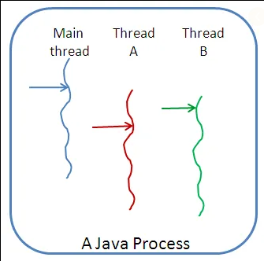

[![Contributors][contributors-shield]][contributors-url]
[![Forks][forks-shield]][forks-url]
[![Stargazers][stars-shield]][stars-url]
[![Issues][issues-shield]][issues-url]
[![MIT License][license-shield]][license-url]
[![LinkedIn][linkedin-shield]][linkedin-url]


A java like implementation of posix threads encapsulated cleanly in a single C++ class.


<!-- PROJECT LOGO -->
<br />
<p align="center">
  <a href="https://github.com/shie-ld/threads">
    
  </a>

  <h3 align="center">Threads</h3>

  <p align="center">
    A java like implementation of posix threads encapsulated cleanly in a single C++ class.
    <br />
    <br />
    <a href="https://github.com/shie-ld/threads/issues">Report Bug</a>
    ·
    <a href="https://github.com/shie-ld/threads/issues">Request Feature</a>
  </p>
</p>


<!-- TABLE OF CONTENTS -->
## Table of Contents

* [About the Project](#about-the-project)
  * [Built With](#built-with)
* [Getting Started](#getting-started)
  * [Prerequisites](#prerequisites)
  * [Installation](#installation-and-usage)
* [Documentation](#documentation)
* [Roadmap](#roadmap)
* [Contributing](#contributing)
* [License](#license)
* [Contact](#contact)
* [Acknowledgements](#acknowledgements)


<!-- ABOUT THE PROJECT -->
## About The Project


This project aims to mimic Java thread behaviors by wrapping Pthreads calls in a C++ class that will let you create threads Java style. Pthreads is commonly used for multithreaded programming in C and C++, but this API is procedural and somewhat less convenient to use than Java’s object oriented thread interface.


### Built With
* [C++](https://www.cplusplus.com/)


<!-- GETTING STARTED -->
## Getting Started


1. `cd` to the threads directory.
2. Type `make`.
3. Run the test application as `./thread`.


### Prerequisites

1. A C++ compiler, like `g++` or `cc` or `clang`.
2. `make` utility.

Both of them mostly come preinstalled in a typical linux distribution like Ubuntu. 

### Installation And Usage

1. Clone the repo
```sh
git clone https://github.com/shie-ld/threads.git
```
2. Get into the cloned directory
```sh
cd threads
```
3. Build the program using `make` utility.
```sh
make
```
4. Run the program.
```sh
./thread
```

<!-- DOCUMENTATION -->
## Documentation

See the [docs](./docs/docs.md).

<!-- ROADMAP -->
## Roadmap

See the [open issues](https://github.com/shie-ld/threads/issues) for a list of proposed features (and known issues).


<!-- CONTRIBUTING -->
## Contributing

Contributions are what make the open source community such an amazing place to be learn, inspire, and create. Any contributions you make are **greatly appreciated**.

1. Fork the Project
2. Create your Feature Branch (`git checkout -b feature/AmazingFeature`)
3. Commit your Changes (`git commit -m 'Add some AmazingFeature'`)
4. Push to the Branch (`git push origin feature/AmazingFeature`)
5. Open a Pull Request


<!-- LICENSE -->
## License

Distributed under the MIT License. See `LICENSE` for more information.


<!-- CONTACT -->
## Contact

dixitrdreshofficial@gmail.com

Project Link: [https://github.com/shie-ld/threads](https://github.com/shie-ld/threads)


<!-- MARKDOWN LINKS & IMAGES -->
<!-- https://www.markdownguide.org/basic-syntax/#reference-style-links -->
[contributors-shield]: https://img.shields.io/github/contributors/shie-ld/threads.svg?style=flat-square
[contributors-url]: https://github.com/shie-ld/threads/graphs/contributors
[forks-shield]: https://img.shields.io/github/forks/shie-ld/threads.svg?style=flat-square
[forks-url]: https://github.com/shie-ld/threads/network/members
[stars-shield]: https://img.shields.io/github/stars/shie-ld/threads.svg?style=flat-square
[stars-url]: https://github.com/shie-ld/threads/stargazers
[issues-shield]: https://img.shields.io/github/issues/shie-ld/threads.svg?style=flat-square
[issues-url]: https://github.com/shie-ld/threads/issues
[license-shield]: https://img.shields.io/github/license/shie-ld/threads.svg?style=flat-square
[license-url]: https://github.com/shie-ld/threads/blob/master/LICENSE.txt
[linkedin-shield]: https://img.shields.io/badge/-LinkedIn-black.svg?style=flat-square&logo=linkedin&colorB=555
[linkedin-url]: https://linkedin.com/in/rudresh-dixit-11a15618a/

